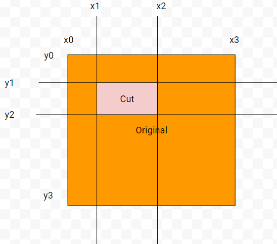

# Creating a Multiplayer Platformer "Game"
This is a document showing my journey in creating an online multiplayer game, using p5.js, Node.js, Express, and Socket.io.
## The idea
**So, why even do this?**<br>
...<br>
Why not?<br><br>
One day, I wanted to try creating some sort of multiplayer game. It would be a cool little project that would be fun to do. I use glitch.com to host the game.
## Using Node.js and Socket.io to create a basic multiplayer interface
First of all, we have to make sure the connection between client and server works. On the server side, a simple socket connection is created.<br><br>
**server.js**
```javascript
const express = require("express"); // Load the express module
const app = express(); // Create an instance of the express module
const http = require("http").createServer(app); // Allow clients to connect to server
const io = require("socket.io")(http, { // Create an input/output connection through socket.io
  transports: ["websocket"]
});

const port = process.env.PORT || 3000; // Set the port to be used, if none specified use 3000

app.get("/", (req, res) => { // Whenever a request is received, send the main index.html file.
  res.sendFile("/public/index.html");
});

http.listen(port, () => { // Listen for incoming requests
  console.log(`Server port: ${port}`);
});

io.on("connection", (socket) => { // Called when a client connects
  console.log(`${socket.id} connected`);
  
  socket.on("disconnect", () => { // Called when a client disconnects
    console.log(`${socket.id} (${names[socket.id]}) disconnected`);
  });
});
```
On the client side, a standard p5.js setup is used, a socket instance is created, and the socket.io module is included in the html. <br><br>
**script.js**
```javascript
const socket = io({
  transports: ["websocket"],
});

function setup() {
}

function draw() {
}
```
**index.html**
```html
<!DOCTYPE html>
<html lang="en">
  <head>
    <meta charset="UTF-8" />
    <meta name="viewport" content="width=device-width, initial-scale=1.0" />
    <title>game</title>
    <script src="p5.min.js"></script>
    <style>
      body {
        background-color: grey;
      }
    </style>
  </head>
  <body>
    <!-- The sketch! -->
    <div id="sketch-container">
      <!-- canvas will be inserted here -->
    </div>
    <script src="socket.io.min.js"></script>
    <script src="script.js"></script>
  </body>
</html>
```
Using node to run this, we can see that the client is able to connect.
```
Server port:3000
LYZqhscpYD9Rju8sAAAB connected
Zg3hT83WKHCDeum-AAAD connected
```
## Creating the character
Now that we have the basic connection established, let's actually add some movement to the character. I decided to send the inputs over to the server, do the calculations there, then send the game state back to the client. This is typically better if the connection is not slow, since there is no way to manipulate the calculations to cheat (i.e. giving yourself a large upwards velocity to fly). <br>
The character will be a square to make collisions easier, and represented with a position (x, y) and half-side length r.<br><br>
**script.js**
```javascript
const socket = io({
  transports: ["websocket"],
});

let r = 10; // Size of the square, changing this has no effect on calculations, only changes how large the players are drawn

let positions;

function setup() {
  frameRate(30); // Lower frame rate allows for a more stable connection
  
  socket.on("positions", (data) => { // Whenever new positions are available, store them.
    positions = data;
  });
}

function draw() {
  let pl = false, pr = false, pu = false, pd = false; // Inputs
  if (keyIsDown(LEFT_ARROW) || keyIsDown(65)) pl = true;
  if (keyIsDown(RIGHT_ARROW) || keyIsDown(68)) pr = true;
  if (keyIsDown(UP_ARROW) || keyIsDown(87)) pu = true;
  if (keyIsDown(DOWN_ARROW) || keyIsDown(83)) pd = true;
  
  socket.emit("update", { // Update the server with the inputs
    l: pl,
    r: pr,
    u: pu,
    d: pd,
  });
  
  translate(0, height); 
  scale(1, -1); // Move and scale the plane to make the origin in the bottom left corner
  background(0);
  
  fill(100);
  for (const id in positions) {
    const position = positions[id];
    rect(position.x - r, position.y - r, r * 2, r * 2); // Draw each square
  }
}
```
The server will be in charge of processing the inputs.<br><br>
**server.js**
```javascript

let sx = 1, sy = 10; // Speed of moving in x/y directions
let g = 1; // Gravity
let r = 10; // Size of squares
let pos = {}; // Position of every player
let vel = {}; // Velocity of every player
let ground = {}; // Whether or not the player is on the ground
let inp = {}; // Every player's inputs

io.on("connection", (socket) => {
  ...
  socket.on("update", (data) => { // Receive the update from clients
    inp[socket.id] = data; // Every player gets a unique id, to distinguish between two players who might choose the same name.
  });
}

const framerate = 30; // Same framerate to sync
setInterval(() => { // Run this once every 1000/framerate milliseconds
  move();

  io.emit("positions", pos); // Send the positions back
}, 1000 / framerate);
function move() {
  for (const id in inp) { // Go through every player's inputs
    const input = inp[id];
    if (input.l) { // Move left
      vel[id].x -= sx;
    }
    if (input.r) { // Move right
      vel[id].x += sx;
    }
    if (input.u) { 
      if (ground[id]) { // Jump if on the ground
        vel[id].y = sy;
        ground[id] = false;
      } else vel[id].y += sy * 0.05; // Add a little bit of velocity if up is held, for a higher jump
    }
    if (input.d) { // Fall down faster
      vel[id].y -= sy * 0.05;
    }
    vel[id].y -= g; // Gravity
    vel[id].x *= 0.9; // Damping to make movement more controllable

    pos[id].x += vel[id].x; // Move in the x direction
    if (pos[id].x < r) { // Check for hitting the boundaries
      pos[id].x = r;
      vel[id].x = 0;
    } else if (pos[id].x > width - r) {
      pos[id].x = width - r;
      vel[id].x = 0;
    }
    pos[id].y += vel[id].y; // Move in the y direction
    if (pos[id].y < r) { // Check for hitting boundaries
      pos[id].y = r;
      ground[id] = true;
      vel[id].y = 0;
    } else if (pos[id].y > height - r) {
      pos[id].y = height - r;
      vel[id].y = 0;
    }
    if (vel[id].y != 0) ground[id] = false; // If moving in the y direction, the player is no longer on the ground.
  }
}
```
This all allows the players to move around, and see the other players. There isn't much to do except move around, so let's add some platforms.
## Platforms
There are many ways to describe platforms, but I decided to do it with two corners.
```javascript
let platform = {x1:x1, y1:y1, x2:x2, y2:y2};
```
One thing to be aware of is that whenever a new platform is created, the coordinates must be changed so that x1 < x2 and y1 < y2. This will become important later.
### Adding platforms
The simplest way to create a set of platforms is to make the player do it :). <br><br>
**script.js**
```javascript
function mouseClicked() {
  if (mouseX < 0 || mouseX > width || mouseY < 0 || mouseY > height) return;
  if (c1) { // Are we on corner 1?
    x1 = mouseX;
    y1 = height - mouseY;
  } else { // We are on corner 2
    x2 = mouseX;
    y2 = height - mouseY;
    if (x1 > x2) { // Swap x and y coordinates if they are in the wrong order.
      let t = x2;
      x2 = x1;
      x1 = t;
    }
    if (y1 > y2) {
      let t = y2;
      y2 = y1;
      y1 = t;
    }
    if (x1 != x2 && y1 != y2)
      socket.emit("platform", { // Verify the platform does not have 0 thickness, then send it over to the server.
        x1: x1,
        y1: y1,
        x2: x2,
        y2: y2,
      });
  }
  c1 = !c1; // Switch the state of which corner is active.
}

function draw() {
  ...
  strokeWeight(5);
  noFill();
  if (!c1) { // Show a rectangle where the platform will be placed
    stroke(0, 255, 0);
    rect(x1, y1, mouseX - x1, height - mouseY - y1);
  }
  noStroke();
  fill(200);
  for (const id in plat) {
    rect(plat[id].x1, plat[id].y1, plat[id].x2 - plat[id].x1, plat[id].y2 - plat[id].y1);
  }
  ...
}
```
**server.js**
```javascript
let plat = [];
io.on("connection", (socket) => {
  ...
  socket.on("platform", (platform) => {
    plat.push(platform); // Receive new platforms
  });
}
const framerate = 30;
setInterval(() => {
  move();

  io.emit("positions", pos);
  io.emit("plat", plat); // Send platforms to all clients
}, 1000 / framerate);
...
```
Now, platforms can be made and seen by all the clients. They still don't do anything, though.
### Collision detection
Because the players and platforms are axis aligned rectangles, detecting whether or not they collide is pretty simple.<br><br>
**server.js**
```javascript
function colCheck(r1, r2) {
  return r1.x2 > r2.x1 && r1.x1 < r2.x2 && r1.y2 > r2.y1 && r1.y1 < r2.y2;
}
```
But why does this actually work? Remember that x2 is always the right side of a rectangle, and x1 is always the left.<br>
The first check asks, is part of the first rectangle on the right side of the left side of the second rectangle?<br>
 <br>
Then, the second check narrows down rectangle 1 to intersecting the x position of rectangle 2.<br>
<br>
The y position checks does the same in the y direction.<br>
<br>
This allows for a check as to whether the rectangles intersect or not.<br>
<br><br>
So we can now determine if the player is touching a platform, but this isn't completely done yet. How would you figure out the side the player collided with, and move it to the correct spot? Instead of trying to see if each side intersects with the player, we can just move in the x direction and y direction seperately, then check for collisions after each. This won't be any less efficient, since the collision check is just 4 comparisons.<br><br>
**server.js**
```javascript
function move() {
  for (const id in inp) {
    ...
    pos[id].x += vel[id].x; // Move in x direction
    let cpos = { // Convert player coordinates into corner coordinates
      x1: pos[id].x - r,
      y1: pos[id].y - r,
      x2: pos[id].x + r,
      y2: pos[id].y + r,
    };
    for (const p in plat) {
      if (colCheck(cpos, plat[p])) { // Check for collision with every platform
        pos[id].x -= vel[id].x; // If there is collision, move back and stop x motion
        vel[id].x = 0;
        break;
      }
    }
    if (pos[id].x < r) {
      pos[id].x = r;
      vel[id].x = 0;
    } else if (pos[id].x > width - r) {
      pos[id].x = width - r;
      vel[id].x = 0;
    }

    pos[id].y += vel[id].y; // Move in y direction
    cpos = { // Convert coordinates to corner coordinates
      x1: pos[id].x - r,
      y1: pos[id].y - r,
      x2: pos[id].x + r,
      y2: pos[id].y + r,
    };
    for (const p in plat) {
      if (colCheck(cpos, plat[p])) { // Check for collision
        pos[id].y -= vel[id].y; // Move back if there is collision
        if (vel[id].y < 0) ground[id] = true; // If falling, the player has touched the ground and can jump again.
        vel[id].y = 0;
        break;
      }
    }
    if (pos[id].y < r) {
      pos[id].y = r;
      ground[id] = true;
      vel[id].y = 0;
    } else if (pos[id].y > height - r) {
      pos[id].y = height - r;
      vel[id].y = 0;
    }
    if (vel[id].y != 0) ground[id] = false;
  }
}
```
Finally, we have a working multiplayer platformer. Let's add a bit more functionality.
### Cutting platforms
Currently, the screen will only fill up more and more with platforms until it becomes impossible to move. Let's add some way to add a "negative" platform that sets a rectangular area to free space. <br>
In theory, cutting platforms seems simple: just split up the platform into smaller platforms that don't include the cut out part. However, the way this is done is important. Every platform has to remain a rectangle for the collision algorithm to work, and there are many ways that a platform can be cut. It would be best to find a way to do this in a way that works for every case.<br><br>
<br>
Have 4 x positions, labeled x0-x3. x0 is the left border of the original rectangle, x3 is the right border, x1 is either the left border of the cut or the left border of the original, whichever is larger (this constrains it to being inside the original). x2 is either the right border of the cut or the right border of the original, whichever is smaller. The x position that has to be removed from the original is between x1 and x2. <br><br>
Doing the same for the y positions, the original is now split up into 9 rectangles, some of which can have 0 area. By removing the original platform and adding the non-center, non-0 area platforms, the cut can be successfully made.<br><br>
**script.js**
```javascript
function mouseClicked() {
  ...
  if (c1) {
    ...
  } else {
    ...
    if (x1 != x2 && y1 != y2)
      socket.emit(keyIsDown(SHIFT) ? "negplatform" : "platform", { // Send a "negative" platform if the shift key is held down
        x1: x1,
        y1: y1,
        x2: x2,
        y2: y2,
      });
  }
  c1 = !c1;
}
```
**server.js**
```javascript
io.on("connection", (socket) => {
  ...
  socket.on("negplatform", (cut) => { // Receive cut action
    cutplatform(cut);
  });
 }
function cutplatform(cut) {
  let x = [0, 0, 0, 0],
    y = [0, 0, 0, 0];
  let nplat = []; // Changed platforms array
  for (let i = 0; i < plat.length; i++) {
    if (colCheck(cut, plat[i])) { // Check if the cut will change the platform
      const p = plat[i];
      x[0] = p.x1; // Set x0-x3 and y0-y3 values
      x[1] = Math.max(cut.x1, p.x1);
      x[2] = Math.min(cut.x2, p.x2);
      x[3] = p.x2;
      y[0] = p.y1;
      y[1] = Math.max(cut.y1, p.y1);
      y[2] = Math.min(cut.y2, p.y2);
      y[3] = p.y2;
      for (let x1 = 0; x1 < 3; x1++) {
        for (let y1 = 0; y1 < 3; y1++) {
          if (x1 == 1 && y1 == 1) continue; // Get every rectangle that is not the center
          if (x[x1] == x[x1 + 1] || y[y1] == y[y1 + 1]) continue; // Get every rectangle that does not have 0 area
          nplat.push({ x1: x[x1], y1: y[y1], x2: x[x1 + 1], y2: y[y1 + 1] }); // Insert this rectangle into the new platform array
        }
      }
    } else nplat.push(plat[i]); // If no effect, move it directly to the new array
  }
  plat = nplat;
}
```
#### Small optimization
One small problem that can arise from this method of cutting is a large number of platforms being created, some of which can be merged together. By checking if the x or y edges of every platform lines up, we can merge together some platforms.<br><br>
**server.js**
```javascript
function cutplatform(cut) {
  ...
  nplat = [];
  let used = []; // Whether or not this platform has already been combined
  for (let i = 0; i < plat.length; i++) used[i] = false;
  for (let i = 0; i < plat.length; i++) {
    for (let j = 0; j < plat.length; j++) { // Try every platform combination
      if (i == j) continue; // Except platforms with themselves
      if (used[j] || used[i]) continue; // And those that have already been used
      if (
        plat[i].x1 == plat[j].x1 &&
        plat[i].x2 == plat[j].x2 &&
        plat[i].y2 == plat[j].y1
      ) { // Do the platforms line up in the y direction?
        nplat.push({
          x1: plat[i].x1,
          y1: Math.min(plat[i].y1, plat[j].y1),
          x2: plat[i].x2,
          y2: Math.max(plat[i].y2, plat[j].y2),
        }); // Create a new platform that covers both original, then mark them as used.
        used[i] = true;
        used[j] = true;
      } else if (
        plat[i].y1 == plat[j].y1 &&
        plat[i].y2 == plat[j].y2 &&
        plat[i].x2 == plat[j].x1
      ) { // Do they line up in the x direction?
        nplat.push({
          x1: Math.min(plat[i].x1, plat[j].x1),
          y1: plat[i].y1,
          x2: Math.max(plat[i].x2, plat[j].x2),
          y2: plat[i].y2,
        }); // Create a new platform that covers both original, then mark them as used.
        used[i] = true;
        used[j] = true;
      }
    }
  }
  for (let i = 0; i < plat.length; i++) {
    if (!used[i]) nplat.push(plat[i]); // Push all uncombined platforms into new array
  }
  plat = nplat;
}
```
## Username
Right now, every player is the same. Let's change this.<br>
We want the player to have to pick a username before they are allowed in. Thus, we add<br>
```javascript
if (username == "") return;
```
to the top of any function which may be called before a name is chosen (mouseClicked, draw). Then, we add the screen which asks for the username, and the ability to get others' usernames.<br><br>
**script.js**
```javascript
function setup() {
  const cnv = createCanvas(800, 500);
  input = createInput(); // Create and position text input
  input.position(20, 65);

  sub = createButton("submit"); // Create and position a submit button
  sub.position(input.x + input.width, 65);
  sub.mousePressed(subUsername); // When the button is pressed, call subUsername()

  usertext = createElement("h2", "Username"); // Create a prompt
  usertext.position(20, 5);
  ...
  socket.on("names", (data) => {
    names = data;
  });
}

function subUsername() {
  username = input.value(); // Store username
  if (username == "") return; // If it is blank, do nothing
  socket.emit("username", username); // Send name to server
  input.remove(); // Delete input elements
  usertext.remove();
  sub.remove();
}
```
We also want to display everyone's names in game.<br><br>
**script.js**
```javascript
function draw() {
  ...
  fill(100, 255, 100);
  textSize(10);
  push(); // Store this drawing state, so we can revert to it.
  scale(1, -1); // Flip screen back, otherwise text will be upside-down
  translate(0, -height);
  for (const id in positions) { // For every player, display their name at the bottom of their character.
    const position = positions[id];
    text(names[id], position.x, height - position.y + r);
  }
  pop(); // Revert to original state.
}
```
Server side, we receive the names and send them back.<br><br>
**server.js**
```javascript
io.on("connection", (socket) => {
  ...
  socket.on("username", (user) => {
    names[socket.id] = user;
    console.log(`User ${user} entered`);
  });
});

setInterval(() => {
  ...
  io.emit("names", names);
}, 1000 / framerate);
```
## In game chat
It's a game. Might as well have a way to communicate inside of it.<br>
The way this will be done is through a text box on the side of the game.<br><br>
**script.js**
```javascript
function setup() {
  ...
  socket.on("msgupdate", (data) => {
    msgs = data; // Get messages in the form of (name, message)
    let total = "";
    for (const m in msgs) {
      total += msgs[m].name + ": " + msgs[m].m; // Add the name and message to the overall html, then add a line break
      total += "<br>";
    }
    msgBox.html("<span>" + total + "</span>"); // Update the message box
  });
}
function subUsername() {
  ...
  msg = createInput(); // Create and position message input 
  msg.position(50, windowHeight / 2 + height / 2 + 20);

  sendmsg = createButton("send"); // Create a send button
  sendmsg.position(msg.x + msg.width, msg.y);
  sendmsg.mousePressed(msgSend); // Call msgSend when it is clicked

  msgBox = createDiv("").size(200, 400); // Create a box where messages show up
  msgBox.addClass("wrap"); // Make sure the box will wrap text
  msgBox.position(40, 100);
  msgBox.style("overflow", "hidden"); // Hide any overflow
  msgBox.style("overflow-wrap", "anywhere"); // Wrap text anywhere into new lines
  
  socket.emit("msgupdate"); // Request all messages
}

function msgSend() { // Send a message
  if (msg.value() == "") return; // No empty messages
  socket.emit("msg", msg.value());
  msg.value(""); // Clear input box
}

function draw() {
  ...
  if (keyIsDown(ENTER)) msgSend(); // For QOL, send message when enter is pressed
}
```
The server will receive messages and store the most recent ones.<br><br>
**server.js**
```javascript

let msgs = [];
let msgkeep = 25;
io.on("connection", (socket) => {
  ...
  socket.on("msg", (msg) => {
    if (msgs.length == msgkeep) msgs.shift(); // If there will be more messages than wanted, remove the first (least recent) one.
    msgs.push({ name: names[socket.id], m: msg }); // Add in the new message and who sent it.
    io.emit("msgupdate", msgs); // Send message to all.
    console.log(names[socket.id] + ": " + msg);
  });
  socket.on("msgupdate", () => {
    io.emit("msgupdate", msgs);
  });
});
```
This works, but the way the username and message text are being handled leaves us vulnerable to a common type of exploit.
### XSS attacks
XSS, or cross site scripting, is an attack in which you can inject HTML code into the website code. Let's see what happens if someone inputs `<b>` into the message box, and then someone else sends a message.<br><br>
First, the message is sent without problem to the server. The server stores the message in the msgs array, and sends the updated array to every client. <br>
When the client receives the message, the total HTML will look something like this:
```html
<span>
  test: <b><br>
  test1: hi<br>
</span>
```
The message box looks like this:
<pre>
test: 
<b>test1: hi</b>
</pre>
The tag is processed as actual code, instead of a message. This leaves the rest of the messages bolded, until the tagged message disappeaers. Bolded text isn't harmful, but this means that scripts can be sent and run through the message box, allowing someone to run malicious programs through it.<br><br>
The solution to this is somewhat simple, just replace any special characters that can break out of the string with ones that will be displayed as the original, but processed like a string.
```javascript
msg = msg.replace(/&/g, "&amp;").replace(/</g, "&lt;").replace(/>/g, "&gt;").replace(/"/g, "&quot;").replace(/'/g, "&#039;");
```
## Storing data in files
Right now, whenever the server is restarted, we lose all the hard work used to create the platforms. It would be better to save every platform. We create a file called data.json alongside the server.js file. We read the data in the file, and every 5 seconds we write the current contents of plat to the file.<br><br>
**server.js**
```javascript
const fs = require('fs');

fs.readFile('data.json', 'utf8', (err, data) => { // Read the data
  try { plat = JSON.parse(data.trim()); } // Parse it into the plat array
  catch (err) { plat = []; console.log(err); } // Error could occur if the file is empty
});

setInterval(() => {
  if (plat.length == 0) return; // Don't write if no platforms, could overwrite them before being loaded (because it is not instant)
  let json = JSON.stringify(plat); // Convert the object to a string
  fs.writeFile('data.json', json, 'utf8', (err) => { if (err) console.log(err); }); // Write to file
}, 5000); // Every 5 seconds
```
We also 
